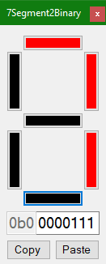

# Seven-Segment to Binary Tool

Easily visualize and export custom combinations of segments.

Select the segments that need to be turned on, copy the binary, and paste in your code.

Currently configured for the `TM1637` seven-segment display.

## Screenshot

