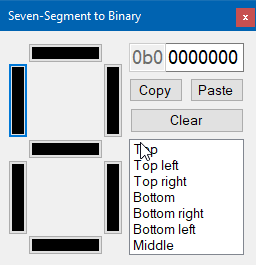

# Seven-Segment to Binary Tool

Easily visualize and export custom combinations of segments.

This tool is useful when creating custom seven-segment characters for displays that connect to Arduino microcontrollers or Raspberry Pi small single-board computers.

Select the segments that need to be turned on, copy the binary, and paste in your code.

## Screenshots

## How to Configure Mapping for Another Display Model

Simply drag and drop the items in the `ListBox` to reorder them. The topmost item represents the segment that maps to the first bit of the output.

(The program is configured out-of-the-box for the `TM1637` seven-segment display.)
